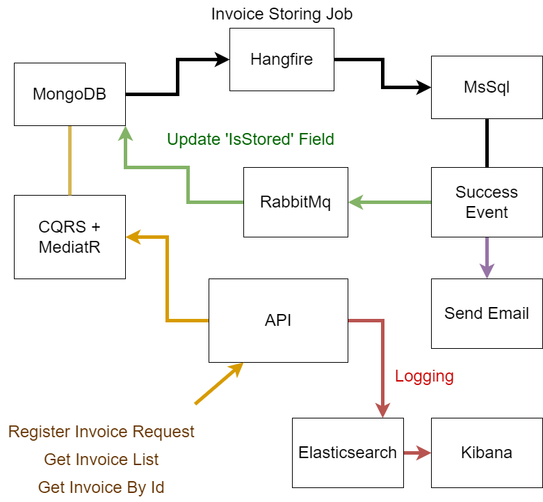

# Invoice Archive System

**[For Turkish version, click here.](./README_TR.md)**

This project is an **Invoice Archive System** designed to handle invoice processing, storage, and management using a combination of modern backend technologies.

## 📜 Project Overview

The system allows users to:
- **Register invoices** in a document-based database (MongoDB).
- **Retrieve invoice lists** and **fetch invoice details**.
- **Store invoices** from MongoDB to an SQL database via a scheduled Hangfire job.
- **Flag invoices as stored** in MongoDB using RabbitMQ messaging.
- **Send email notifications** after successful invoice storage.
- **Log system activities** using Elasticsearch and Kibana.

## 🏗️ System Architecture



### 🛠️ Technologies Used

- **.NET Core 8** (Web API)
- **MongoDB** (Document-based storage)
- **MSSQL** (Relational database)
- **RabbitMQ** (Message queue)
- **Hangfire** (Background job scheduling)
- **MassTransit** (Message bus abstraction)
- **Elasticsearch & Kibana** (Logging and monitoring)
- **Serilog** (Structured logging)
- **MediatR & CQRS** (Command and query responsibility segregation)
- **Repository Pattern** (Database abstraction)
- **FluentValidation** (Request validation)
- **AutoMapper** (Object mapping)

## 🚀 API Endpoints

### 1️⃣ **Invoice Management**
```http
POST /createinvoice
```
**Description:** Registers a new invoice.

```http
GET /getinvoices
```
**Description:** Retrieves a list of invoice headers.

```http
GET /getinvoicebyid/{id}
```
**Description:** Fetches an invoice by its ID.

### 2️⃣ **Stored Invoice Management**
```http
GET /getstoredinvoices
```
**Description:** Retrieves a list of stored invoices from MSSQL.

```http
GET /getstoredinvoicebyid/{id}
```
**Description:** Fetches a stored invoice by its database ID.

```http
GET /getstoredinvoicebyinvoiceid/{invoiceid}
```
**Description:** Fetches a stored invoice by its original Invoice ID.

```http
GET /getstoredinvoiceslist
```
**Description:** Retrieves a paginated list of stored invoices.

### 3️⃣ **Background Job for Storing Invoices**
```http
GET /addorupdatejobstoreinvoices?cronExpression=*/15 * * * *
```
**Description:** Adds or updates a scheduled job that moves invoices from MongoDB to MSSQL.

## 🏗️ System Workflow

1. **Invoice Registration**  
   - API receives an invoice request.
   - Invoice is **stored in MongoDB**.
   - Elasticsearch logs the request.

2. **Background Job (Hangfire)**  
   - **Fetches unstored invoices** from MongoDB.
   - **Saves them into MSSQL**.
   - Triggers a **RabbitMQ message** to update MongoDB's `IsStored` field.

3. **Post-Storage Actions**  
   - A **success event** is published via RabbitMQ.
   - A **notification email** is sent using SMTP.

## 🔥 Logging & Monitoring

- **Serilog** captures and logs API requests.
- **Elasticsearch** stores logs.
- **Kibana** is used for log visualization.


## 🏁 Conclusion

This project is a complete invoice archival solution that integrates **CQRS, messaging, background jobs, and logging** for a scalable, efficient system.
